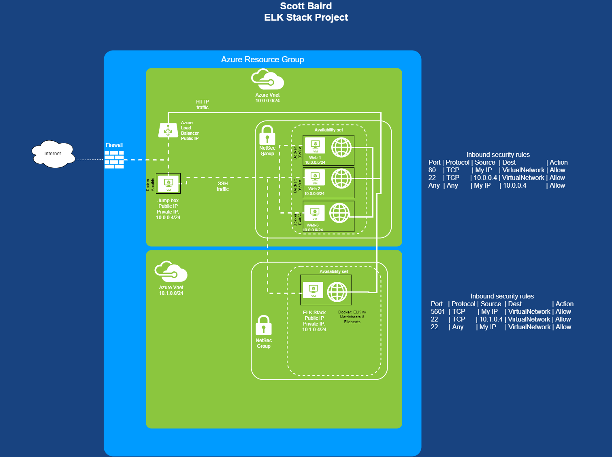
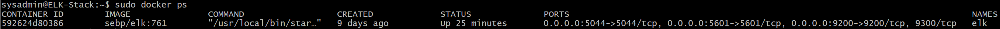
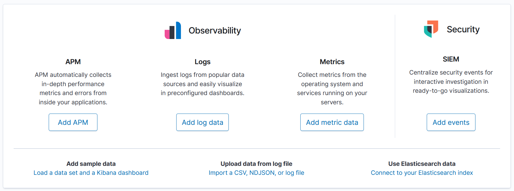

# Project_ELK_Stack
# Author: Scott Baird, aka "Tiscin"
A project creating an ELK stack in an Azure environment. Project contains network diagramming, configuration files, and screenshots.


This project is part of the U of U Cyber Security Bootcamp course.


## Automated ELK Stack Deployment

The files in this repository were used to configure the network depicted below.



These files have been tested and used to generate a live ELK deployment on Azure. They can be used to either recreate the entire deployment pictured above. Separate playbooks were used to install Filebeat and Metricbeat, though could be easily combined into a single playbook file.

  /Ansible/file-playbook.yml
  /Ansible/metricbeat-playbook.yml

This document contains the following details:
- Description of the Topology
- Access Policies
- ELK Configuration
  - Beats in Use
  - Machines Being Monitored
- How to Use the Ansible Build

### Description of the Topology

The main purpose of this network is to expose a load-balanced and monitored instance of DVWA, the Damn Vulnerable Web Application.

Load balancing ensures that the application will be highly available, in addition to restricting access to the network.

The advantage of the Jump Box was having a single point from which to adminster changes to the Azure resource group.

Integrating an ELK server allows users to easily monitor the vulnerable VMs for changes to the filesystem and system logs. Filebeat was used to automatically import the Web-* logs into Kibana for analysis.  Metricbeat was used to monitor the health of the Docker containers.

The configuration details of each machine may be found below.


| Name     | Function | IP Address | Operating System |
|----------|----------|------------|------------------|
| Jump Box | Gateway  | 10.0.0.1   | Linux            |
| Web-1    | DVWA     | 10.0.0.5   | Linux            |
| Web-2    | DVWA     | 10.0.0.6   | Linux            |
| Web-3    | DVWA     | 10.0.0.9   | Linux            |
| ELK      | ELK      | 10.1.0.1   | Linux            |

### Access Policies

The machines on the internal network are not configured to accept any connection other than HTTP traffice to the DVWA site.

Only the Jump Box machine can accept SSH connections from the Internet. Access to this machine is only allowed from my own public IP.

Machines within the network can only be accessed by the Jump Box.

A summary of the OS-level access policies in place can be found in the table below.

| Name            | Publicly Accessible | Allowed IP Addresses                         |
|-----------------|---------------------|----------------------------------------------|
| Jump Box        | Yes - SSH only      | OS: My public IP only                        |
| ELK             | HTTP only           | OS: Virtual network; HTTP(5601) My IP only   |
| Load balancerer | HTTP only           | HTTP(80) - routes traffic to Web-*           |
| Web-*           | HTTP only           | OS: Virtual network; HTTP(80) My IP only     |

### Elk Configuration

Ansible was used to automate configuration of the ELK machine. No configuration was performed manually, which is advantageous due to time savings and ensuring that all machines are identically configured - it prevents human error of missing a step.

The playbook implements the following tasks:
- Install Python PIP
- Install Docker
- Configure Docker to use more memory
- Install ELK container
- Enables Docker to run at start

The following screenshot displays the result of running `docker ps` after successfully configuring the ELK instance.



### Target Machines & Beats
This ELK server is configured to monitor the following machines: Web-1, Web-2, and Web-3 (IPs listed above).

I have installed the following Beats on these machines: Filebeats and Metricbeats.

These Beats allow ELK to collect the system logs and Docker performance metrics from each machine.

### Using the Playbook
In order to use the playbook, you will need to have an Ansible control node already configured. Assuming you have such a control node provisioned: 

SSH into the control node and follow the steps below:
- Copy all files in the  folder to your /etc/ansible
- Update the files as indicated on the 
- Run the  playbook, and navigate to http://[your_IP]:5601/app/kibana to check that the installation worked as expected.

If successful, you should be greeted with:



Commands to execute from your Linux home directory. You may need to run some commands as sudo.

```bash
$ git clone https://github.com/Tiscin/Project_ELK_Stack.git
$ cp /Project_ELK_Stack/Ansible /etc/ansible
$ cd /etc/ansible
```

Modify ansible.cfg, elk-install.yml, and hosts as directed on the Ansible readme

```bash
$ ansible-playbook elk-install.yml
```

Open your browser and go to the IP indicated above.